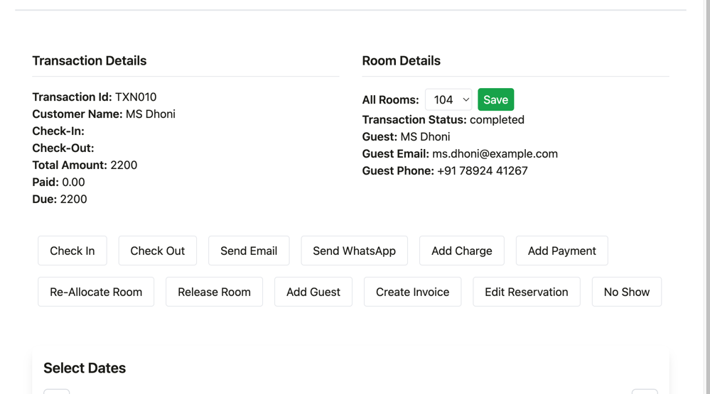

# 🏨 Zotel – Stay Calendar Reservation System

Zotel is a room reservation management system featuring a custom-built, calendar-style booking interface — entirely made without using any third-party calendar library.

---

## 🧠 Purpose

Zotel is designed to streamline hotel room management. It provides:
- A **fully interactive stay calendar**
- Easy **booking, editing, and updating** of reservations
- Ability to **view unallocated guests**
- Smart UI to **re-allocate rooms** with available options shown on double click

---

## 🚀 Live Demo

🟢 [Live App (Heroku)](https://zotel-assignment-9c6b4fd01960.herokuapp.com/)  
_(Replace with actual URL if hosted)_

---

## 💡 Features

- 📆 Fully customized **Stay Calendar** built from scratch — **no external calendar libraries used**
- 🖱️ **Double-click on a booking cell** to:
    - View available rooms instantly in a dropdown
    - Reassign the reservation to a different room and save
- 🧾 View **detailed guest info & transaction** in a reservation popup
- 🔁 Seamlessly **edit reservation dates** directly from the calendar

